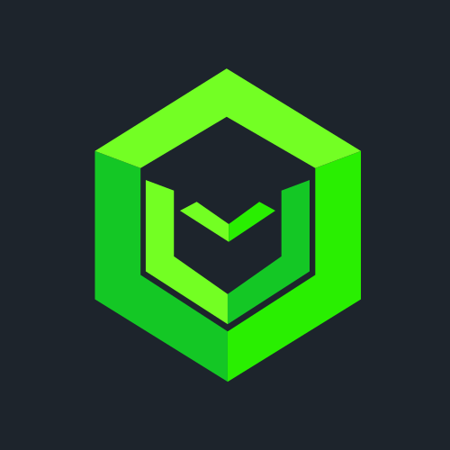

# 🌟 Verdom Studio

**Building exceptional digital experiences through innovative technology**

---

## 👋 Welcome to Verdom Studio

At **Verdom Studio**, we're passionate about crafting cutting-edge digital solutions that push the boundaries of what's possible. Our team of dedicated developers, designers, and innovators work together to create exceptional web applications, mobile experiences, and digital platforms that make a real impact.

## 🎯 What We Do

- **🌐 Full-Stack Web Development**: Modern, scalable web applications using the latest technologies
- **📱 Mobile App Development**: Native and cross-platform mobile solutions
- **☁️ Cloud & DevOps**: Robust infrastructure and deployment strategies
- **🎨 UI/UX Design**: User-centered design that delivers exceptional experiences
- **🔧 Custom Solutions**: Tailored software solutions for unique business needs
- **🚀 Digital Transformation**: Helping businesses modernize their technology stack

## 💻 Tech Stack & Expertise

### Frontend

### Backend

### Cloud & DevOps

### Mobile

## 🌟 Our Development Philosophy

### Quality First
- **Code Reviews**: Every line of code is peer-reviewed
- **Testing**: Comprehensive test coverage for all projects
- **Documentation**: Clear, maintainable documentation for everything we build

### Collaboration & Transparency
- **Open Communication**: Regular team syncs and transparent project tracking
- **Knowledge Sharing**: Internal tech talks and best practice documentation
- **Community Engagement**: Active participation in open source projects

### Continuous Learning
- **Technology Updates**: Staying current with latest frameworks and tools
- **Team Growth**: Investing in team member development and training
- **Innovation**: Experimenting with emerging technologies and methodologies

## 🎯 Current Focus Areas

- **🤖 AI/ML Integration**: Implementing intelligent features in web applications
- **🔐 Security**: Advanced security practices and zero-trust architecture
- **♻️ Sustainability**: Green coding practices and efficient resource usage
- **📊 Performance**: Optimizing applications for speed and scalability
- **🌐 Web3**: Exploring blockchain and decentralized technologies
- **🤖 IoT**: Revolutionizing industries with intelligent, autonomous machines.

### 💼 Services
- Custom software development
- Technical consulting
- Code audits and optimization
- Team augmentation
- Technology migration

### 🔗 Get In Touch
- **Email**: --
- **Website**: --
- **LinkedIn**: --
- **Twitter**: --

---

**Building the future, one commit at a time** 🚀

Made with ❤️ by the Verdom Studio team

